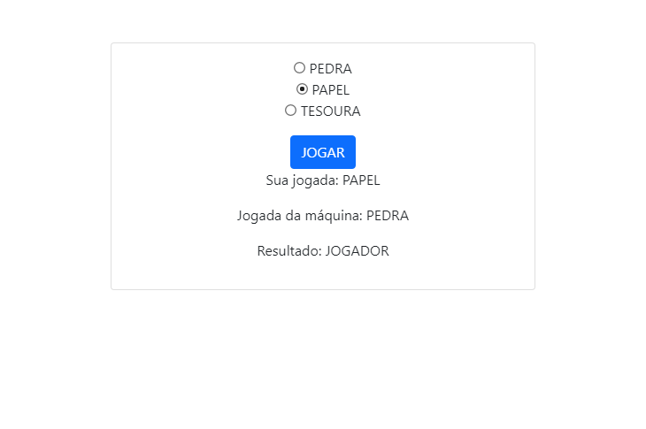

# JOKENPÔ!

### Sobre o projeto

Foram utilizadas as ferramentas do Spring e do Thymeleaf. Busquei ao máximo evitar expor regras de negócio na camada de View (o número de rodadas antes do resultado ser exibido,  por exemplo). Além disso, busquei reduzir ao máximo o número de requisições feitas ao Backend. Possíveis melhorias no Frontend podem vir através da conversão para uma SPA. Além disso, seria interessante a exibição das últimas partidas em uma espécie de ranking.

### Siga os passos para rodar o programa: 

<ol>
<li> Acessando o MySql

  ``` mysql -u root -p ```
  
  Digite a senha ('root') na próxima linha e aperte *Enter*
</li>

<li> Criando a base de dados

  ``` CREATE DATABASE jokenpo; ```
</li>

<li> Compile o código Java </li>

<li> Rode o método *Main* da classe

  ``` src/main/java/dev/gabriel/Jokenpo/JokenpoApplication.java ```
  
</li>
  
  <li> No navegador, abra a página  
    
   ``` localhost:8080/home ```
    
  </li>

</ol>

### Screenshots

#### /home    


#### /home    


#### /novaJogada    


#### /novaJogada  


#### /resultado  


